# Aura-Grid: High-Performance Distributed DeFi Security Suite 🚀


[](https://www.rust-lang.org/)
[](https://www.python.org/)
[](https://nodejs.org/)
[](https://opensource.org/licenses/MIT)
[](https://github.com/xsourabhsharma/aura-grid)

**Aura-Grid** is a production-grade, distributed static analysis suite designed for real-time security auditing of smart contracts. It combines a high-speed **Rust-based scanning engine** with a **Distributed AI validation layer** to identify and verify critical DeFi vulnerabilities with sub-millisecond latency.

---

## 🛠️ The "Hybrid-AI" Architecture

Aura-Grid operates on a 3-tier distributed architecture, optimized for high throughput and ultra-low latency.

```mermaid
graph TD
    User((User/API)) -->|POST /scan| Controller[Node.js Controller]
    Controller -->|LPUSH| Redis[(Redis Task Queue)]
    Redis -->|BRPOP| Worker[Python Worker]
    subgraph "Elite Scanning Node"
        Worker -->|FFI| Rust[Aura-Rust Elite Core]
        Rust -->|Flag Threat| AI[AI Validation Layer]
    end
    AI -->|Confidence Score| Worker
    Worker -->|Broadcast| WS[WebSocket Server]
    WS -->|Live Telemetry| UI[Cyberpunk Dashboard]
```



---

## 🚀 "One-Click" Quick Start (Windows)

1.  **Prerequisites:** 
    - [Python 3.10+](https://www.python.org/)
    - [Node.js 18+](https://nodejs.org/)
    - [Rust (Maturin)](https://rustup.rs/): `pip install maturin`
    - [Redis](https://redis.io/docs/getting-started/installation/windows/): Running on `localhost:6379`

2.  **Clone the Repo:** 
    ```bash
    git clone https://github.com/xsourabhsharma/aura-grid.git
    cd aura-grid
    ```

3.  **Setup Environment:** 
    - Copy `.env.example` to `.env`.
    - Add your `AI_API_KEY` (OpenAI, Groq, etc.) to the `.env` file.

4.  **Launch the Grid:** 
    - Double-click **`start_aura_grid.bat`**.
    - This will automatically build the Rust core, install dependencies, and launch all components.

5.  **View Results:** Open `dashboard.html` in your browser.

---

## 🛡️ Vulnerability "Kill List"

| Vulnerability | Detection Engine | Severity |
| :--- | :--- | :--- |
| **Critical Reentrancy** | Aura-Rust-Elite | 🔴 CRITICAL |
| **Unprotected DelegateCall** | Aura-Rust-Elite | 🔴 CRITICAL |
| **Flash Loan Vectors** | Aura-Rust-Elite | 🟠 HIGH |
| **Signature Malleability** | Aura-Rust-Elite | 🟠 HIGH |
| **Governance Delay Risks** | Aura-Rust-Elite | 🟡 MEDIUM |
| **Uninitialized Proxies** | Aura-Rust-Elite | 🔴 CRITICAL |

---

## 🧪 Verification & Testing

To test if the system is working, run:
```bash
python test_aura_grid.py
```
This sends a sample reentrancy vulnerability to the grid. Watch your dashboard flash red and the **"Verified by AI"** badge appear!

---

## 📜 License
This project is licensed under the **MIT License**.

---
*Maintained by [xsourabhsharma](https://github.com/xsourabhsharma)*
