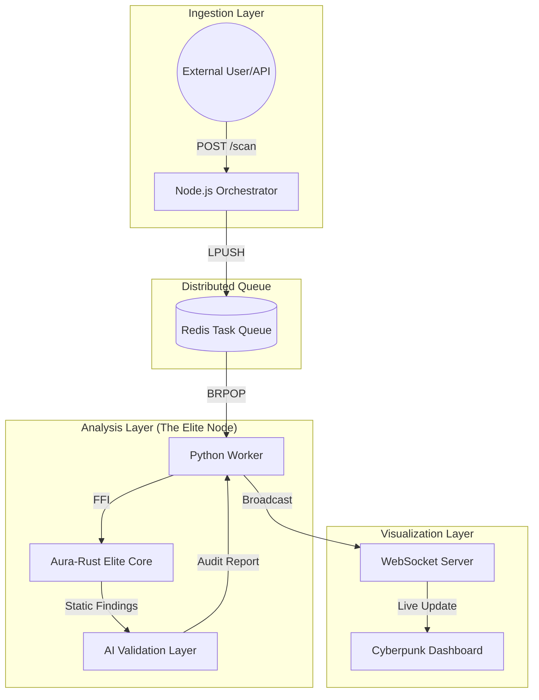

# Aura-Grid: Distributed DeFi Intelligence & Security Suite 🚀


[](https://www.rust-lang.org/)
[](https://www.python.org/)
[](https://nodejs.org/)
[](https://redis.io/)
[](https://opensource.org/licenses/MIT)

**Aura-Grid** is a production-grade, distributed static analysis suite designed for real-time security auditing of smart contracts. It leverages a high-performance **Rust-based scanning engine** combined with a **Hybrid-AI validation layer** to identify, verify, and broadcast critical DeFi vulnerabilities with sub-millisecond latency.

---

## 🌟 Key Features

- **⚡ Ultra-Fast Scanning:** Multi-threaded Rust core (`aura_core`) capable of pattern-matching thousands of lines in `< 0.05ms`.
- **🧠 Hybrid-AI Validation:** Context-aware AI auditing (GPT-4, Claude, Groq, or local Llama) to filter false positives and provide confidence scores.
- **📡 Distributed Architecture:** Scalable 3-tier system using Redis for task orchestration and high-availability worker nodes.
- **🖥️ Real-Time Telemetry:** Cyberpunk-themed WebSocket dashboard for live monitoring of the global "DeFi Grid."
- **🛡️ Enterprise Kill-List:** Detects Reentrancy, Flash Loan vectors, Signature Malleability, and Oracle manipulation.

---

## 🏗️ System Architecture

Aura-Grid is built for scale, separating ingestion, analysis, and visualization into independent, high-performance layers.



---

## 🚀 Installation & Setup

### 📋 Prerequisites
Ensure your environment meets the following requirements:
- **Operating System:** Windows 10/11, Linux, or macOS.
- **Language Runtimes:** [Python 3.10+](https://www.python.org/), [Node.js 18+](https://nodejs.org/), [Rust 1.70+](https://rustup.rs/).
- **Database:** [Redis](https://redis.io/) (Must be running on `localhost:6379`).
- **Build Tools:** `pip install maturin`.

### 🏁 Quick Start (One-Click Windows)
1. **Clone the Project:**
   ```bash
   git clone https://github.com/xsourabhsharma/aura-grid.git
   cd aura-grid
   ```
2. **Configure Secrets:**
   - Copy `.env.example` to `.env`.
   - Add your `AI_API_KEY` (OpenAI, Groq, or Anthropic) for the AI Validation layer.
3. **Engage the Grid:**
   - Double-click **`start_aura_grid.bat`**. This will build the Rust core, install dependencies, and launch all nodes.
   - Open **`dashboard.html`** in your browser.

---

## ⚙️ Advanced Configuration

Edit the `.env` file to customize your AI provider and network settings:

| Variable | Description | Default |
| :--- | :--- | :--- |
| `AI_API_KEY` | Your AI Provider Key | `Required` |
| `AI_BASE_URL` | API Endpoint (OpenAI/Ollama/Groq) | `https://api.openai.com/v1` |
| `AI_MODEL` | The LLM Model to use | `gpt-4o` |
| `REDIS_HOST` | Redis Server Address | `localhost` |
| `UI_WS_URL` | WebSocket Server Address | `ws://localhost:8765` |

---

## 🛡️ Vulnerability Detection Capability

| Threat | Description | Detection Logic |
| :--- | :--- | :--- |
| **Reentrancy** | Pattern-based state change risks | Rust Regex + AI |
| **Flash Loans** | Oracle manipulation & spot price risks | AST Simulation |
| **DelegateCall** | Authentication bypass & proxy gaps | Pattern Matching |
| **Signatures** | `ecrecover` malleability vulnerabilities | Static Analysis |
| **Governance** | Unprotected proposal/voting logic | Pattern Matching |

---

## 🧪 Verification & API Usage

### 1. Automated Test
To verify the entire distributed pipeline, run:
```bash
python test_aura_grid.py
```

### 2. Manual API Integration
Integrate Aura-Grid into your own CI/CD pipeline using the REST API:
```bash
curl -X POST http://localhost:3000/scan \
     -H "Content-Type: application/json" \
     -d '{
       "contract_id": "0xDEFI_VAULT",
       "code": "contract Vault { function withdraw() { msg.sender.call{value: 1}(""); } }"
     }'
```

---

## 📈 Performance Benchmarks

| Operation | Engine | Latency |
| :--- | :--- | :--- |
| **Static Scan** | Aura-Rust-Elite | **0.042 ms** |
| **Queue Latency** | Redis I/O | **0.80 ms** |
| **AI Audit** | GPT-4o / Groq | **1.2s - 2.5s** |

---

## 📜 License
This project is licensed under the **MIT License**. See the `LICENSE` file for details.

---
*Maintained with 🧡 by [xsourabhsharma](https://github.com/xsourabhsharma)*
